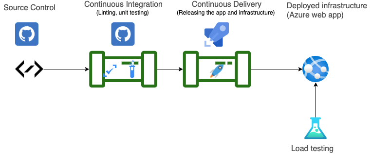
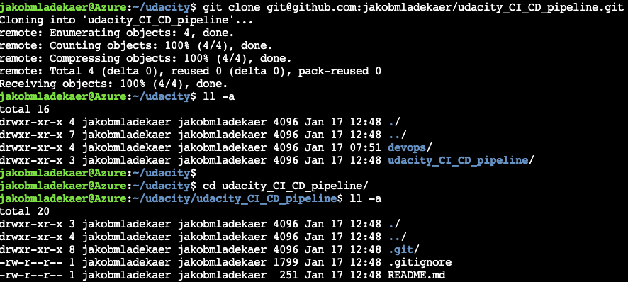
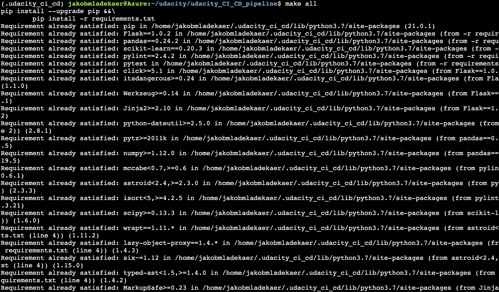
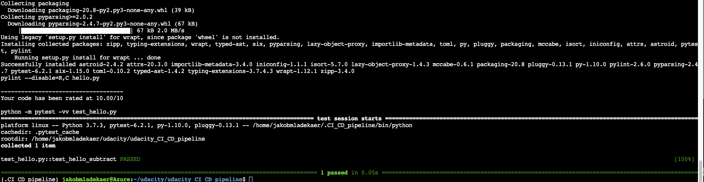
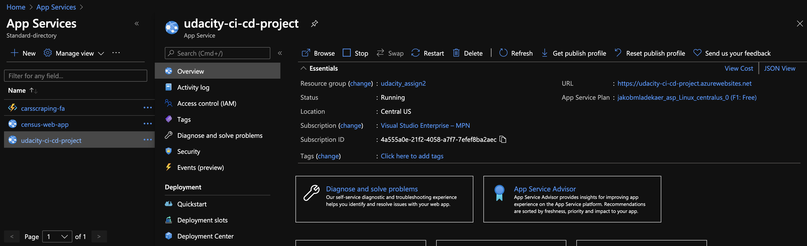
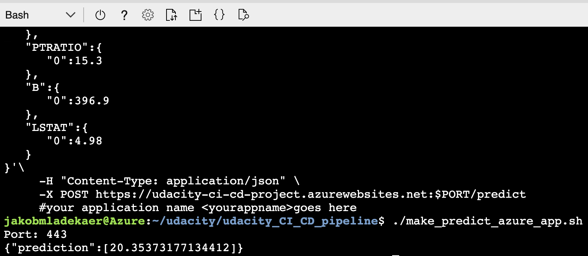
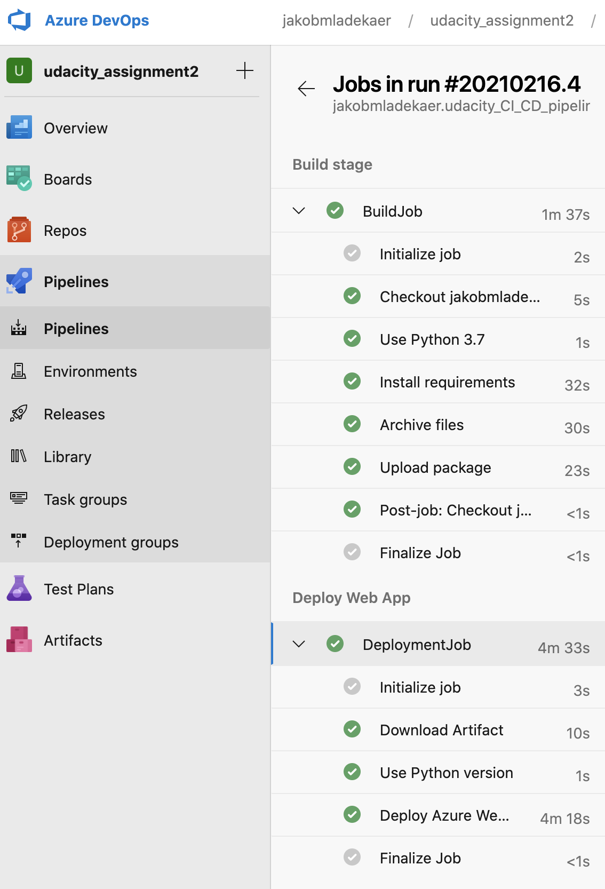
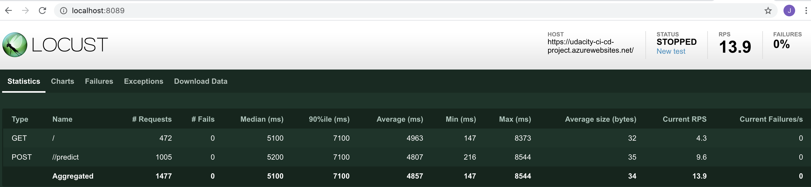
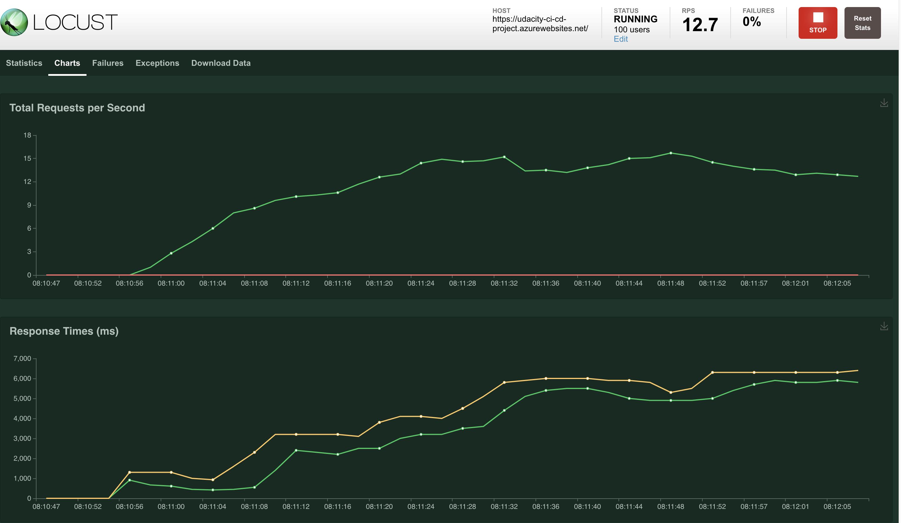

# Project: Building a CI/CD pipeline

### Introduction
This project demonstrates how to build a CI/CD pipeline that deploys a web application holding a machine learning prediction endpoint served using the flask framework. The CI/CD pipeline will automate code linting and unit testing on a commit to the main branche (Contineous Intergration) and after checking this, the pipeline goes ahead and automatically deploys the application to an Azure web app. 

The project uses GitHub as the remote source code repository, Github Actions for the CI pipeline and Azure DevOps Pipelines for the automatic delivery of the application to an Azure Web Service (CD)

Finally the project will create a load test on the web service using locust and measure the response rate per second handled by the application when the number of users increases

### Architectural drawing

### Getting Started
1. Download the assignment file
2. Place these files in the github repository

### Dependencies
1. Create a [github account](https://github.com/)
    1. create a repository to store the source code
2. Create a [Azure DevOps Account](https://dev.azure.com/)
    1. Connect Azure DevOps with Github repositories
1. Create an [Azure Account](https://portal.azure.com) 
2. Install the [Azure command line interface](https://docs.microsoft.com/en-us/cli/azure/install-azure-cli?view=azure-cli-latest)

Make sure that azure cli is added to your PATH and can be used from the command line

## Instructions

### Continuous Integration
*Setting up*

To set up  a contineous integration pipeline and test the application manually we use the Azure cloud shell available in the Azure portal. 

To clone the repository we must first generate a ssh key in the cloud shell and provide the public ssh key to github. 
After that we simple clone the repository, which will output the following: 

*Project cloned into Azure Cloud Shell*

*Manually test application from Azure cloud shell*

Run the tests levering pytest by typing  make all from the cloud shell and see the following output:

*Passing tests that are displayed after running the make all command from the Makefile*

use GitHUb Actions to set up a CI pipeline that builds the environment, lints the code and tests the application againts the provided unit tests located in the test folder. 

The pipeline will be triggered on every commit to the main branch and will make sure that the application is always in a working state. 

The pipeline consists of a few different steps configured in the YAML file in the repo named pythonapp.yml found in the workflows folder

### Continuous Delivery

We first manually deploy the flask application using az cli from the cloud shell. The command for this deployment is found in the shell script named commands.sh in the repository. 

This builds the application using Azure App which looks like the following, when deployed on Azure

After deployment we can test the prediction endpoint in the web application by executing the shell script make_predict_azure_app.sh from the azure cloud shell which yield the following output: 

**CD Pipeline**

The purpose of configuring a continuous delivery pipeline is to automatically rebuild the application and supporting infrastructure whenever there is a code change committed to the main branch. 

We use Azure Pipelines which is apart of Azure DevOps instead of Github Actions for building the CD pipeline keeping the remote source code repository at github. 
We leverage an existing azure pipeline template for deploying a linux python web app and the corresponding yaml file is stored as azaure-pipelines.yml in the repository. 
The CD pipeline is triggered upon a commit to main and the piepline carries out the steps as shown in the picture below.

**Load Testing**
When deploying a web application it is neccessary to investigate the amoun of request the app can process before "breaking". 
Locust is used to simulate multiple users and multiple request to the flask application. 

The figure below shows the load capacity simulating 100 users and we see the response time to our POST request with the JSON payload for prediction increases rapidly with more users and requests

## Azure DevOps Principles and Practices

Breaking a project down into smaller parts and planning for the next sprint is an important part of the agile development phase 
*Spreadsheet*

To plan for the project activites and to highlight aims for the short and longer time horizon an Excel spreadsheet has been leverage. 
A [Spreadsheet](ProjectPlan.xlsx) is included in the Repo and named: 

Trello is additionally used to give an interactive kanban board experiance where tasks are planned, tracked and moved as they progress

Link to a [Trello](https://trello.com/b/yTQlTqPd/project-building-a-ci-cd-pipeline) project kanban board

To see a demo screencast of the project go to this link on [YouTube](
https://www.youtube.com/watch?v=xIWZDIa7EIo)

## Future improvements

To improve the application it would be benficial to increase the level of security for the web app adding a authentication layer so only the targeted  users have access to the web application. Additionally the load test showed room for improvements in the response time for handling a possible increasing consumption. The current app service plan is the free tier and it would be naturally to bump up the tier to B1, B2 or B3 depending on the possible load.  

